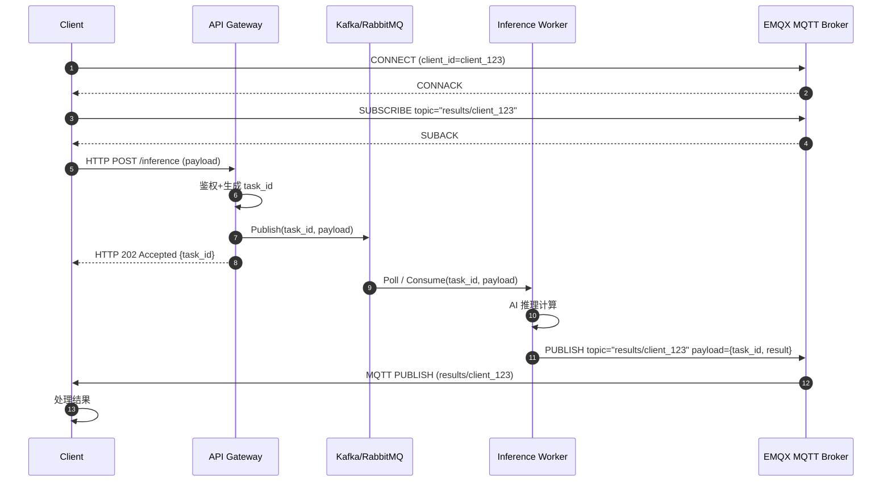
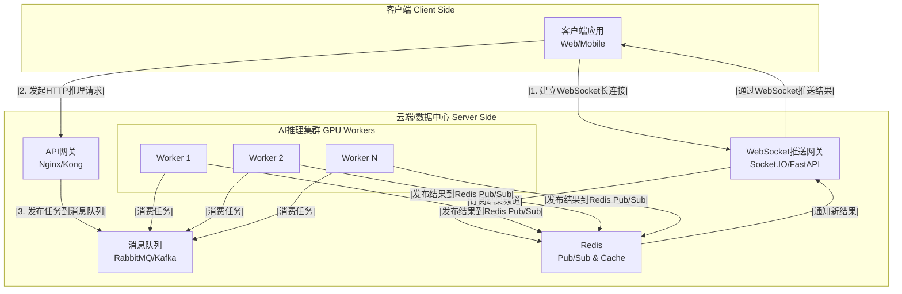
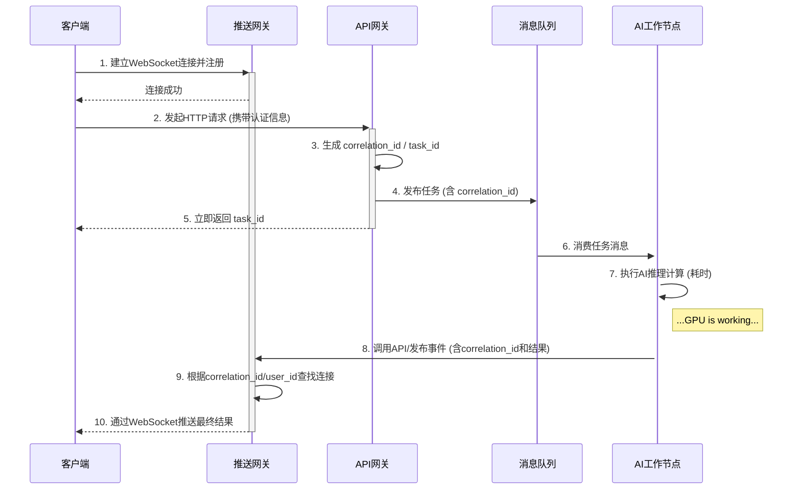

# 分布式AI实时推理平台技术方案

## 1. 概述 (Overview)

本方案旨在设计一个高性能、高可用、可弹性伸缩的分布式AI推理平台。平台的核心目标是支持大规模并发的AI计算任务，同时为调用方（客户端）提供近乎实时的结果反馈。

为实现此目标，系统将采用**异步处理、消息驱动、实时推送**的核心架构思想，将重量级的AI计算任务与轻量级的客户端交互完全解耦，确保系统的整体稳定性和卓越的用户体验。

## 2. 核心组件 (Core Components)

平台由以下五个核心组件构成：

1.  **API网关 (API Gateway):**
    
    *   **职责:** 系统的统一入口，负责接收客户端的初始HTTP请求。
        
    *   **功能:** 请求认证、速率限制、生成任务ID (`task_id`/`correlation_id`)、将任务发布到消息队列，并立即向客户端返回任务ID。
        
2.  **消息队列 (Message Queue):**
    
    *   **职责:** 系统的中央“任务总线”，作为API网关和AI推理工作节点的缓冲和解耦层。
        
    *   **功能:** 接收推理任务、持久化消息、确保任务至少被一个工作节点消费。
        
3.  **AI推理工作集群 (Inference Workers):**
    
    *   **职责:** 系统的计算核心，是部署了AI模型的GPU消费者节点。
        
    *   **功能:** 从消息队列订阅并拉取任务，执行AI计算，并将结果发送给消息推送服务。可水平扩展以应对负载变化。
        
4.  **消息推送服务 (Push Notification Service):**
    
    *   **职责:** 负责将异步完成的计算结果实时、可靠地推送给正确的客户端。
        
    *   **功能:** 管理客户端的长连接（如WebSocket）、缓存离线消息、处理消息重试和推送。
        
5.  **客户端 (Client Application):**
    
    *   **职责:** 最终用户或调用方应用。
        
    *   **功能:** 与推送服务建立长连接，通过API网关提交任务，并被动等待接收推送的结果。
        

## 3. 方案设计与对比

我们基于推荐的开源组件，设计以下三种具体的实现方案。

---

#### 方案A：企业级协议驱动方案 (MQTT)

本方案采用工业标准MQTT协议贯穿前后端，构建一个极为可靠和通用的系统。

*   **技术选型:**
    
    *   **消息队列:** Kafka (用于内部高吞吐量任务分发) 或 RabbitMQ。
        
    *   **消息推送服务:** **EMQX** (一个大规模、高可用的MQTT服务器)。
        
*   **数据流:**
    

1.  客户端使用MQTT库连接到EMQX，并订阅一个私有结果主题，如 `results/client_123`。
    
2.  客户端向API网关发起HTTP请求。
    
3.  API网关将任务发布到内部消息队列Kafka。
    
4.  AI工作节点从Kafka消费任务，执行计算。
    
5.  完成后，AI工作节点**也作为一个MQTT客户端**，连接到EMQX，并将结果发布到对应的私有结果主题 `results/client_123`。
    
6.  EMQX将结果通过MQTT协议实时推送给客户端。
    
7.  **优势:**
    
8.  **协议标准化:** 前后端通信都基于MQTT标准，跨平台、跨语言支持极佳，尤其适合移动端和IoT设备。
    
9.  **高可靠性:** MQTT协议本身支持QoS（服务质量）等级，能保证消息的可靠投递。EMQX本身也是为大规模集群设计的。
    
10.  **功能强大:** EMQX提供完整的ACL（权限控制）、消息缓存、连接管理等功能。
    
11.  **劣势:**
    
12.  **客户端复杂度:** 客户端需要集成MQTT库，相比简单的HTTP和WebSocket，有一定的学习成本。
    
13.  **运维复杂度:** 需要维护两套消息系统（内部的Kafka/RabbitMQ和外部的EMQX），尽管它们可以合并，但职责不同时分开更清晰。
    

---

#### 方案B：Web生态友好方案 (WebSocket网关)

本方案最适合Web应用，通过自建或使用框架构建WebSocket网关，灵活性最高。

*   **技术选型:**
    
    *   **消息队列:** RabbitMQ (其AMQP协议非常适合RPC和复杂路由)。
        
    *   **消息推送服务:** **自建WebSocket网关 (使用Socket.IO, FastAPI, Django Channels) + Redis Pub/Sub**。
        
*   **数据流:**
    

1.  客户端与WebSocket网关建立长连接。网关记录下客户端ID与连接的映射关系。
    
2.  客户端向API网关发起HTTP请求。
    
3.  API网关将任务发布到RabbitMQ。
    
4.  AI工作节点从RabbitMQ消费任务，执行计算。
    
5.  完成后，AI工作节点将结果发布到**Redis的Pub/Sub频道**。
    
6.  WebSocket网关订阅了此Redis频道，收到结果后，根据其中的客户端ID找到对应的WebSocket连接，并将结果推送出去。
    
7.  **优势:**
    
8.  **灵活性和控制力最高:** 推送逻辑完全由自己掌控，可以深度定制业务功能。
    
9.  **技术栈统一:** 可以和现有Web后端（如Node.js, Python）集成在一起，减少了独立组件的运维成本。
    
10.  **Web友好:** WebSocket是现代Web应用实时通信的事实标准。
    
11.  **劣势:**
    
12.  **开发成本:** 需要自行开发和维护WebSocket网关的高可用、伸缩性和消息缓存重推逻辑。
    
13.  **责任重大:** 所有推送的可靠性都依赖于自建服务的代码质量。
    

---

#### 方案C：开箱即用推送方案 (Soketi)

本方案旨在用最少的开发成本，快速部署一个专业的、独立的推送服务。

*   **技术选型:**
    
    *   **消息队列:** RabbitMQ 或 Kafka。
        
    *   **消息推送服务:** **Soketi** (Pusher协议的开源实现)。
        
*   **数据流:**
    

1.  客户端使用Soketi的客户端库连接到Soketi服务器，并订阅私有频道。
    
2.  客户端向API网关发起HTTP请求。
    
3.  API网关将任务发布到RabbitMQ。
    
4.  AI工作节点从RabbitMQ消费任务，执行计算。
    
5.  完成后，AI工作节点通过**调用Soketi的REST API**，向指定频道发布结果。
    
6.  Soketi负责将消息通过WebSocket实时推送给客户端。
    
7.  **优势:**
    
8.  **开发效率最高:** Soketi是开箱即用的，后端只需调用一个简单的HTTP接口即可完成推送，极大简化了AI工作节点的逻辑。
    
9.  **功能成熟:** Soketi自带频道、认证、多节点广播等功能，无需重复开发。
    
10.  **运维简单:** 作为一个独立的、无状态的服务，Soketi易于部署和水平扩展。
    
11.  **劣势:**
    
12.  **引入新组件:** 需要额外部署和维护一个Soketi集群。
    
13.  **灵活性限制:** 定制化能力不如方案B，受限于Soketi提供的功能和API。
    

---

#### 4. 架构图与数据流转图

**推荐架构图 (以方案B为例，最具代表性)**

此图展示了系统的静态组件和它们之间的连接关系。

代码段

**数据流转时序图 (Sequence Diagram)**

此图展示了一个请求从开始到结束的完整动态流程。

代码段

---

#### 5. 总结与建议

本方案提出的三种架构均能满足分布式AI推理服务的核心需求，选择哪一种主要取决于您的团队技术栈、开发资源和对系统控制力的要求。

*   **追求快速上线和稳定服务：** **方案C (Soketi)** 是最佳选择，它在开发效率和系统成熟度之间取得了最好的平衡。
    
*   **追求极致灵活性和技术栈统一：** **方案B (自建WebSocket网关)** 更为合适，尤其当您已经拥有一个强大的Web后端团队时。
    
*   **追求工业级标准和跨平台兼容性：** **方案A (MQTT/EMQX)** 在构建需要与移动端、IoT设备深度互通的平台时，具有无与伦比的优势。
    

对于大多数以Web为核心业务的团队，**我们初步推荐从方案C或方案B入手**，它们能够以现代化的方式高效地解决核心问题。

好的，这是一个关于Soketi、Ably、Pusher和MQTT的深度横向评测。这四者解决了相似的问题——实时消息推送，但它们的性质、架构和适用场景有很大不同。

首先，我们必须明确它们的分类：

*   **Pusher & Ably**: 商业化、全托管的实时消息云服务 (SaaS - Software as a Service)。你按量付费，无需关心服务器运维。
    
*   **Soketi**: 开源、可自托管的实时消息服务器。功能上对标Pusher，但你需要自己部署和维护。
    
*   **MQTT**: 一种开放的、标准化的消息传输**协议**，并非具体产品。你需要使用实现了该协议的**Broker**（服务器），如EMQX (开源/商业)、Mosquitto (开源) 等来搭建服务。
    

---

## 4. 消息推送方案核心特性横评矩阵

| 特性 | [**Pusher**](https://pusher.com/) | [**Ably**](https://ably.com/docs/push) | [**Soketi**](https://docs.soketi.app/) | **MQTT (以EMQX为例)** |
| --- | --- | --- | --- | --- |
| **模型** | SaaS (商业云服务) | SaaS (商业云服务) | 开源 (可自托管) | 开源/商业 (可自托管/云) |
| **核心协议** | WebSocket (自定义协议) | WebSocket, MQTT, SSE等 | WebSocket (兼容Pusher协议) | MQTT (可桥接WebSocket) |
| **易用性** | **极高** | **高** | **中等** | **中等** |
| **运维成本** | **无** | **无** | **高** (需自行部署、监控、扩展) | **高** (需自行部署、监控、扩展) |
| **费用** | 按连接数和消息量计费 | 按峰值连接数和消息量计费 | 硬件和人力成本 | 硬件和人力成本 (开源版免费) |
| **可扩展性** | 由官方保障 | 由官方保障 | **良好** (需手动配置集群) | **极高** (专为大规模集群设计) |
| **消息历史** | 支持 (付费功能) | 支持 | **不支持** (需自行实现) | 支持 (部分Broker支持) |
| **在线状态(Presence)** | 支持 | 支持 | 支持 | 支持 (通过共享订阅和上下线事件) |
| **多协议支持** | 弱 (主要为自家协议) | **极强** (多协议转换) | 弱 (兼容Pusher协议) | **强** (原生MQTT, 可扩展) |
| **QoS(服务质量)** | 不支持 (依赖TCP) | 不支持 (依赖TCP) | 不支持 (依赖TCP) | **原生支持** (QoS 0, 1, 2) |
| **生态与客户端** | 丰富 | 丰富 | 兼容Pusher生态 | **极为丰富** (所有平台都有库) |
| **数据所有权** | 数据在第三方平台 | 数据在第三方平台 | **完全自有** | **完全自有** |

---

### 详细分析

#### 1. Pusher: 简单易用的行业标杆

Pusher (现为Pusher Channels) 是实时消息推送领域的早期入局者，以其极其简单的API和完善的文档著称。

*   **优势:**
    
    *   **极致的易用性:** API设计得非常直观，文档和教程极其丰富，开发者上手速度极快。
        
    *   **成熟稳定:** 经过多年市场验证，服务非常稳定可靠。
        
    *   **丰富的前端生态:** 拥有各种主流前端框架的官方或社区SDK。
        
*   **劣势:**
    
    *   **价格昂贵:** 随着连接数和消息量的增长，成本会迅速攀升。
        
    *   **功能相对基础:** 相比Ably，它在协议支持、消息排序、全球延迟优化等方面较为逊色。
        
    *   **厂商锁定风险:** 业务深度绑定Pusher平台。
        
*   **适用于:**
    
    *   **初创公司和快速原型开发：** 需要快速验证产品，对开发效率要求极高。
        
    *   **中小型Web应用：** 如网站的实时通知、简单的在线聊天、仪表盘数据更新等。
        
    *   **开发者体验优先的团队。**
        

#### 2. Ably: 功能强大的企业级SaaS

Ably定位比Pusher更高，它不仅仅是一个推送服务，更是一个完整的实时通信数据流网络，强调全球化、高可靠和多协议支持。

*   **优势:**
    
    *   **强大的多协议支持:** 原生支持WebSocket, MQTT, Server-Sent Events (SSE) 等多种协议，并能在它们之间无缝转换。这意味着你的后端可以用MQTT发布，而Web前端用WebSocket接收。
        
    *   **全球化架构:** 在全球有多个接入点，能显著降低全球用户的访问延迟。
        
    *   **保证消息送达与排序:** 提供了比Pusher更强的数据一致性保证。
        
    *   **功能全面:** 提供消息历史、在线状态、消息Delta压缩等高级功能。
        
*   **劣势:**
    
    *   **价格更贵:** 功能更强，价格自然也更高，是这几者中最昂贵的选项之一。
        
    *   **API相对复杂:** 功能更多，学习曲线比Pusher稍陡。
        
*   **适用于:**
    
    *   **有出海业务的全球化应用：** 对全球低延迟有严格要求。
        
    *   **金融、协作、游戏等企业级应用：** 对消息的可靠性、顺序性要求高。
        
    *   **需要兼容多种设备和协议的复杂场景。**
        

#### 3. Soketi: 开源的Pusher替代品

Soketi的出现就是为了解决Pusher的两个痛点：价格和数据所有权。它在功能上与Pusher保持兼容，但让你能把服务部署在自己的服务器上。

*   **优势:**
    
    *   **零成本软件:** 软件本身开源免费，只需支付服务器硬件和带宽费用。
        
    *   **数据隐私与所有权:** 所有数据和连接都在自己的控制之下，满足数据合规性要求。
        
    *   **兼容Pusher生态:** 无需改变前端代码，就可以从Pusher平滑迁移到Soketi。
        
    *   **无厂商锁定:** 完全的控制权和自由度。
        
*   **劣势:**
    
    *   **高昂的运维成本:** 你需要自己负责部署、配置、监控、告警、扩容、缩容、安全防护等一系列运维工作，这对团队的技术能力是巨大考验。
        
    *   **不提供SLA保障:** 服务的可用性完全取决于你自己的运维水平。
        
    *   **缺少高级功能:** 像消息历史、全局路由优化等高级功能需要自行开发或借助其他系统实现。
        
*   **适用于:**
    
    *   **对数据隐私有严格要求的行业：** 如金融、医疗、政务等。
        
    *   **成本敏感且技术实力强的团队：** 能够驾驭自建服务的复杂性，以节省SaaS费用。
        
    *   **开发和测试环境：** 在本地搭建一个与Pusher兼容的环境进行开发，无需支付费用。
        

#### 4. MQTT: 工业级的物联网协议

MQTT是一种协议，不是一个产品。将它与前三者对比时，我们实际上是在对比“使用MQTT协议自建/托管服务”与“使用特定SaaS服务”这两种模式。

*   **优势:**
    
    *   **轻量高效:** 协议头部开销极小，专为低带宽、不稳定的网络设计，非常省电省流量。
        
    *   **工业级可靠性 (QoS):** 原生支持三种服务质量等级（最多一次、至少一次、正好一次），这是它相对于WebSocket协议的最大优势，能保证消息在不可靠网络下的可靠投递。
        
    *   **极度通用和开放:** 作为OASIS标准，所有平台都有海量的客户端库支持，生态系统极为庞大，无任何厂商锁定。
        
    *   **可扩展性极强:** 像EMQX这样的MQTT Broker，在设计之初就是为了支持千万级甚至亿级的海量设备连接。
        
*   **劣势:**
    
    *   **协议本身不等于完整解决方案:** MQTT只负责消息传输。像用户在线状态、消息历史、复杂的认证授权等，需要Broker提供支持或自行在上层应用中实现。
        
    *   **运维复杂度 (同Soketi):** 如果选择自建Broker，同样面临高昂的运维成本。
        
    *   **Web端使用稍繁琐:** 虽然MQTT可以通过WebSocket进行桥接，但在Web端直接使用WebSocket（如Socket.IO或Soketi）通常比引入一个完整的MQTT客户端库更直接。
        
*   **适用于:**
    
    *   **物联网 (IoT):** 这是MQTT的绝对主场，如车联网、智能家居、工业传感器数据采集。
        
    *   **即时通讯 (IM):** 很多主流IM应用（如Facebook Messenger）的底层都使用了MQTT。
        
    *   **需要极高连接数和可靠消息投递的场景。**
        

---

### 总结与如何选择

*   **如果你想“最快、最省事”地解决问题，并且预算充足：**
    
    *   **Pusher** 是你的首选，尤其对于Web应用。
        
    *   如果你的应用需要面向全球，且对消息可靠性要求更高，选择 **Ably**。
        
*   **如果你想“完全掌控一切”，并且“不想花SaaS的钱”：**
    
    *   如果你的应用主要是**Web端**，并且想复用Pusher的生态，选择 **Soketi**。
        
    *   如果你的应用场景是**物联网、移动端IM**，或需要极高的连接数和工业级的可靠性，选择 **MQTT + 开源Broker (如EMQX)**。
        
*   **成本考量下的抉择路径：**
    

1.  **原型阶段:** 使用 **Pusher** 的免费套餐快速开发。
    
2.  **成长阶段:** 当Pusher的费用变得高昂时，评估迁移成本。如果技术团队有能力，可以考虑将后端服务切换到 **Soketi**，前端代码几乎不用改动。
    
3.  **大规模/IoT场景:** 直接选择 **MQTT** 架构，从一开始就为海量连接和高可靠性做准备。